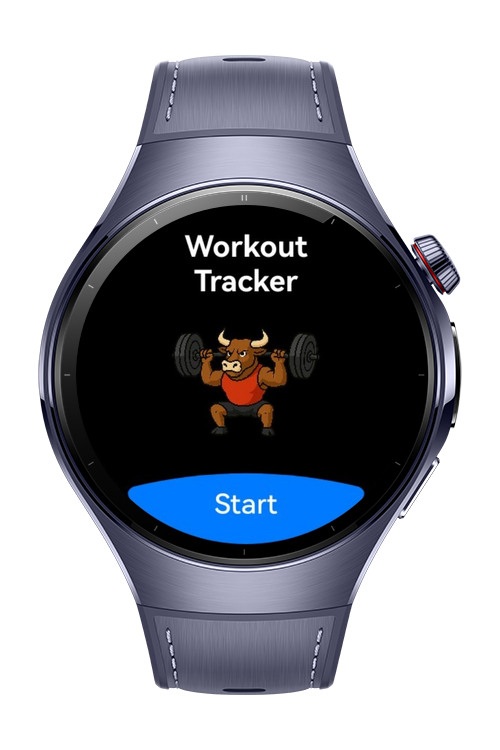
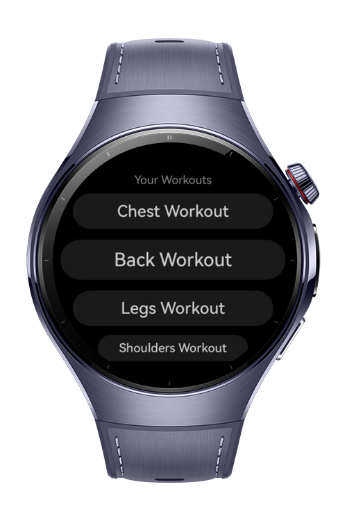
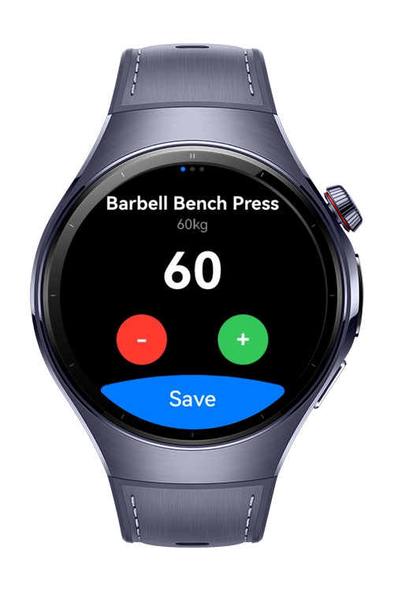

> **Note:** To access all shared projects, get information about environment setup, and view other guides, please visit [Explore-In-HMOS-Wearable Index](https://github.com/Explore-In-HMOS-Wearable/hmos-index).

# Workout Tracker

Workout Tracker makes logging strength sessions fast and frictionless directly on your wrist. The UI is optimized for round screens, and keeps interactions to a minimum so you can focus on lifting, not tapping.

# Preview

<div>
    
    
    
</div>
  
# Use Cases

Set weight via controls and saves it locally so the exercise preloads the last used weight next time.

# Tech Stack

Languages: ArkTS
Frameworks: HarmonyOS SDK 5.1.0(18)
Tools: DevEco Studio Vers 5.1.0.820
Libraries: `@kit.ArkUI`

# Directory Structure

```
entry/src/main/ets/
|---entryability
|---|---EntryAbility
|---entrybackupability
|---|---EntryBackupAbility
|---model
|---|---Workout             // Data model for workouts and exercises
|---pages
|---|---HomePage            // Displays the list of workouts
|---|---Index               // Main entry navigation
|---|---StarterPage         // Welcome page
|---|---WorkoutDetailPage   // Detailed view of a single workout 
|---storage
|---|---LocalStore          // Local data saving and loading
```

# Constraints and Restrictions

## Supported Devices

- Huawei Watch 5

# LICENSE

WorkoutTracker is distributed under the terms of the MIT License.
See the [LICENSE](/LICENSE) for more information.